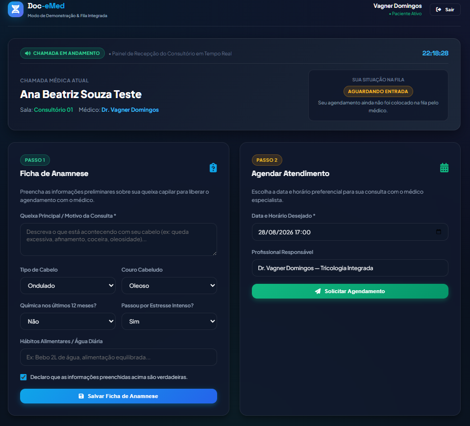
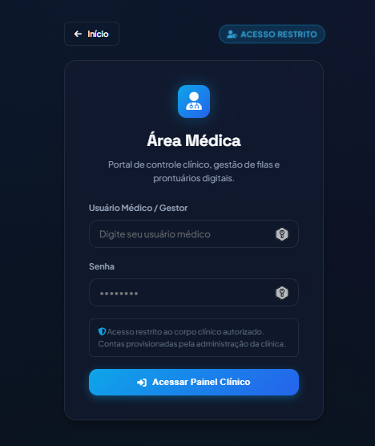
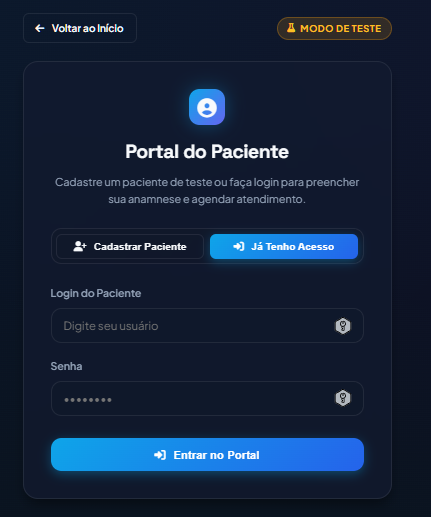
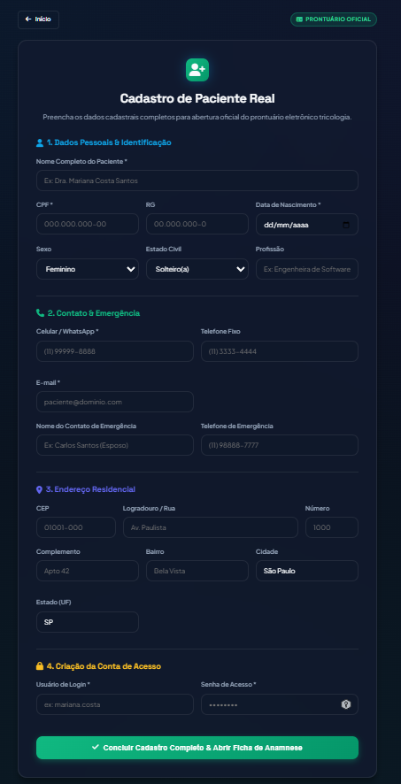

<div align="center">

# 🏥 Doc-eMed

### Sistema Inteligente de Gestão Clínica, Prontuário Eletrônico e Ficha de Avaliação Capilar (144 Questões)

Plataforma Web desenvolvida em **Java 21** com **Spring Boot**, **Thymeleaf**, **Server-Sent Events (SSE)** em tempo real e banco de dados **MariaDB 11.4** para gestão de pacientes, catálogo dinâmico de perguntas, agendamento de consultas e sistema de filas com suporte a telão na recepção.

[](https://openjdk.org/)
[](https://spring.io/projects/spring-boot)
[](https://mariadb.org/)
[](https://swagger.io/)
[](https://github.com/profkesede-hbr/VAGNER-DOMINGOS-DA-SILVA-Projeto-Final)
[](https://www.ifsp.edu.br/)

---

### 🌐 Link Público Oficial de Apresentação (Acesso Global Gratuito 24/7)
👉 **[https://publicly-chem-nursery-chapter.trycloudflare.com](https://publicly-chem-nursery-chapter.trycloudflare.com)**

</div>

---

## 📖 Sobre o Projeto

O **Doc-eMed** é um sistema completo de prontuário eletrônico e triagem clínica especializado em **Terapia Capilar e Tricologia Integrada**, desenvolvido para o projeto de conclusão de curso do **IFSP (Instituto Federal de São Paulo)**.

O sistema elimina o uso de fichas de papel na coleta de dados de saúde, disponibilizando:
1. **Frontend Nativo Java (Spring Boot + Thymeleaf + Design System Glassmorphic)** responsivo e moderno.
2. **Digitalização Integral da Ficha Oficial de Avaliação Capilar (SPA Brasil Cursos)** com **144 perguntas clínicas**.
3. **Módulo de Agendamentos & Triagem Obrigatória** (só libera solicitação após preenchimento da anamnese).
4. **Sistema de Filas de Atendimento em Tempo Real (SSE)** com chamadas visuais e sonoras.
5. **Prontuário Médico Completo & Receituário Digital do Paciente** com impressão de receitas e orientações home care.
6. **Dashboard Administrativo / Médico** com gráficos analíticos (Chart.js) de patologias e tipos de couro cabeludo.
7. **Telão Público da Recepção (TV)** para chamada de pacientes na sala de espera.

---

## 📸 Demonstração Visual das Interfaces (Screenshots do Sistema)

Abaixo estão apresentadas as principais telas da plataforma com a explicação funcional de cada módulo:

---

### 1. 📺 Portal do Paciente com Telão & Fila em Tempo Real Integrados
> **Caminho da Imagem:** `docs/images/01-paciente-portal-fila-integrada.png`

<div align="center">
  
</div>

* **Painel da Recepção ao Vivo no Topo:** O paciente acompanha em tempo real o relógio sincronizado, a indicação de quem está sendo chamado no momento, o consultório e o médico responsável.
* **Status Pessoal na Fila:** Card dedicado indicando a posição exata do paciente na fila de espera (*"Aguardando Entrada"*, *"Posição #1"*, *"É a sua vez!"*).
* **Passo 1 (Ficha de Anamnese Express):** Coleta estruturada das queixas principais, tipo de cabelo, características do couro cabeludo, histórico de químicas e hábitos de vida com termo de responsabilidade.
* **Passo 2 (Agendamento Inteligente):** Seleção de data/hora preferencial para a consulta com o especialista, protegido por trava lógica que exige o preenchimento prévio da anamnese.

---

### 2. 🔒 Área Médica — Autenticação Segura & Acesso Restrito
> **Caminho da Imagem:** `docs/images/02-medico-login-restrito.png`

<div align="center">
  
</div>

* **Blindagem de Acesso:** Interface restrita aos médicos e gestores clínicos autorizados.
* **Segurança Reforçada:** Sem exibição pública de credenciais ou senhas pré-preenchidas.
* **Governança Clínica:** O cadastro e provisionamento de novos médicos é realizado exclusivamente pela direção do sistema (sem autocadastro público para profissionais).

---

### 3. 🧪 Portal do Paciente — Cadastro Rápido (Modo de Testes)
> **Caminho da Imagem:** `docs/images/03-paciente-cadastro-teste.png`

<div align="center">
  
</div>

* **Onboarding Ágil para Demonstrações:** Permite cadastrar rapidamente um paciente de teste informando Nome, Celular/WhatsApp, Usuário de Login, Senha, Sexo e Cidade.
* **Entrada Direta no Fluxo:** Ao concluir o cadastro, o paciente é autenticado automaticamente e direcionado ao preenchimento da anamnese e agendamento da consulta.

---

### 4. 🔑 Portal do Paciente — Login (Modo de Testes)
> **Caminho da Imagem:** `docs/images/04-paciente-login-teste.png`

<div align="center">
  
</div>

* **Aba de Acesso Rápido:** Permite aos pacientes já cadastrados no modo de teste ingressarem diretamente com seu usuário e senha.
* **Recuperação de Sessão:** Carrega automaticamente a ficha de anamnese salva, status da consulta agendada e posição na fila.

---

### 5. 📝 Cadastro de Paciente Real — Prontuário Oficial Completo
> **Caminho da Imagem:** `docs/images/05-paciente-cadastro-real-completo.png`

<div align="center">
  
</div>

* **1. Dados Pessoais & Identificação:** Nome Completo, CPF (com validação única), RG, Data de Nascimento, Sexo, Estado Civil e Profissão.
* **2. Contato & Emergência:** Celular/WhatsApp, Telefone Fixo, E-mail e contato de emergência (Nome e Telefone do responsável).
* **3. Endereço Residencial:** CEP, Logradouro, Número, Complemento, Bairro, Cidade e Estado.
* **4. Criação da Conta de Acesso:** Definição do usuário e senha criptografada para acesso ao portal e histórico de receituários digitais.

---

## 🧭 Ambientes e Módulos Disponíveis

| Módulo | Rota | Descrição |
| :--- | :--- | :--- |
| **Página Inicial** | `/` | Apresentação com seleção dos 3 perfis de acesso |
| **Modo de Testes (Demonstração)** | `/paciente/acesso` | Cadastro simplificado + Anamnese Express + **Telão de Chamada Embutido na Tela** |
| **Paciente Real (Oficial)** | `/paciente/real-cadastro` | Cadastro completo (identificação, endereço, contato de emergência) + **Ficha de 144 Perguntas** |
| **Área Médica (Profissional)** | `/medico/login` | Dashboard clínico com gráficos, triagem de agendamentos, remarcação, prontuário e gestão de fila |
| **Telão da Recepção (TV)** | `/painel-chamada` | Visualização em tela cheia para televisores de recepção com sino sonoro |
| **Swagger UI (Docs)** | `/swagger-ui.html` | Documentação interativa de todos os endpoints REST |

---

## 🔒 Controle de Acesso & Segurança

O acesso à **Área Médica e Administrativa** é estritamente restrito aos profissionais de saúde e gestores autorizados. O cadastro e provisionamento de contas médicas é realizado de forma interna e exclusiva pela administração do sistema, não havendo autocadastro público para profissionais. O autocadastro na plataforma é disponibilizado unicamente para os pacientes.

---

## ✨ Funcionalidades Detalhadas

### 1. Ficha de Avaliação Capilar (144 Perguntas — Páginas 1 a 8)
1. **Tricologia Inicial:** Tipo de cabelo, pigmentação residual e característica do couro cabeludo.
2. **Alimentação & Hábitos:** Frutas, legumes, verduras, hidratação diária, glúten, lactose e hábitos nutricionais.
3. **Histórico Geral de Saúde (25 Patologias):** Coração, diabetes, câncer, alergias, hipertensão, histórico neurológico, tireoide, COVID-19, problemas renais/hepáticos, cirurgias, marca-passo e autoimunes.
4. **Medicamentos & Fisiologia:** Uso contínuo, anticoncepcionais, SOP, ciclo menstrual e **Escala de Bristol (Enum `TIPO_1` a `TIPO_7`)**.
5. **Histórico da Queda Capilar:** Início, eventos marcantes, novos fios, perda corporal e densidade.
6. **Aspecto do Cabelo & Química:** Químicas nos últimos 12 meses (tinturas, luzes, alisamentos) e condição do fio.
7. **Couro Cabeludo & Tricoscopia:** Teste de tração, caspas, dermatite, psoríase, foliculite e 12 achados microscópicos.
8. **Classificação de Alopecias:** Androgenética (Hamilton/Ludwig), Areata, Eflúvio Telógeno, Eflúvio Anágeno e Cicatriciais.
9. **Exames Laboratoriais:** 21 marcadores (Hemograma, Ferritina, Vitamina D, TSH, DHT, Testosterona, etc.).
10. **Termo de Consentimento:** Aceite digital das informações declaradas.

---

## 🏗️ Arquitetura e Tecnologias

```
Doc-eMed Platform (v1.0.1)
├── Frontend (Thymeleaf, CSS Moderno Glassmorphic, Chart.js, SSE Realtime Client)
├── Backend (Spring Boot 4.1.0, Spring Data JPA, Spring MVC, Lombok, Springdoc OpenAPI)
├── Banco de Dados (MariaDB 11.4 Dedicado - Porta 3307)
└── Túnel de Acesso Público (Cloudflare Tunnel HTTPS)
```

---

## 🚀 Como Executar Localmente

### 1. Pré-requisitos
* **Java 21** LTS instalado (`java -version`)
* **Maven 3.9+** (ou utilizar o `./mvnw.cmd` incluído)
* **MariaDB / MySQL** configurado no `application-local.properties`

### 2. Execução
```powershell
# Executar a aplicação via Maven Wrapper
.\mvnw.cmd spring-boot:run

# Ou executar o pacote JAR compilado
java -jar target/doc-emed-1.0.1.jar
```

Acesse em seu navegador: **`http://localhost:8080/`**

---

## 👥 Equipe de Desenvolvimento (IFSP 2025.2)

* **Vagner Domingos da Silva** — *Desenvolvedor & Arquiteto*
* **Jorge Wilker Mamede de Andrade** — *Desenvolvedor*
* **Luis Javier Leon Cardenas** — *Desenvolvedor*

**Orientação Acadêmica:**
* **Prof. Kesede R. Julio** — *Professor Orientador (Instituto Federal de São Paulo - IFSP)*

---

## ⚖️ Licença

Este projeto está sob a licença [Apache 2.0](https://www.apache.org/licenses/LICENSE-2.0).