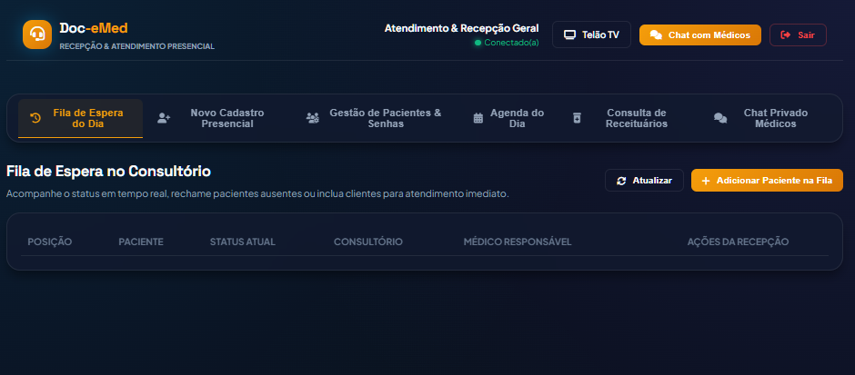
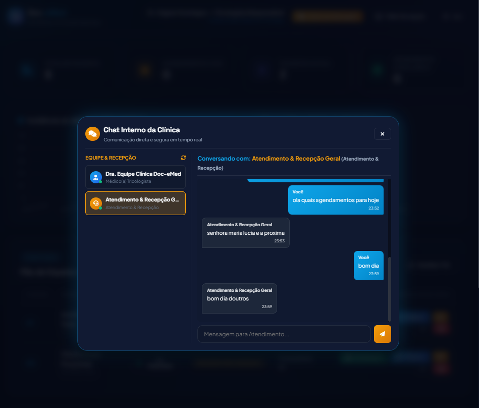
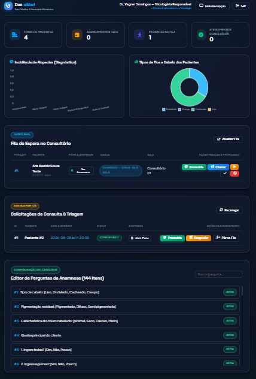
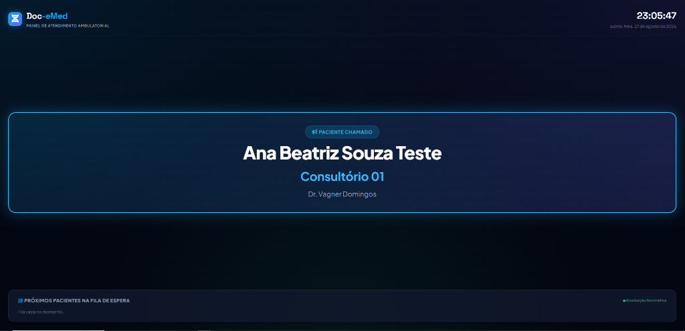

<div align="center">


# 🏥 Doc-eMed (v1.1.0) — Plataforma Integrada de Gestão Clínica, Recepção Presencial & Prontuário Tricológico

### Sistema Inteligente de Acolhimento, Triagem Médica, Chat Clínico 1-para-1 em Tempo Real, Fila Virtual Hospitalar e Digitalização da Ficha de Avaliação Capilar (144 Questões)

Plataforma Web Full Stack desenvolvida em **Java 21 LTS** com **Spring Boot 4.1.0**, **Thymeleaf**, **Server-Sent Events (SSE)** com keepalive em tempo real e banco de dados **MariaDB 11.4** para gestão de pacientes presenciais e online, triagem ambulatorial, prontuário eletrônico, receituário digital magistral e sistema de filas com suporte a telão na recepção.

[](https://openjdk.org/)
[](https://spring.io/projects/spring-boot)
[](https://mariadb.org/)
[](https://swagger.io/)
[](https://github.com/profkesede-hbr/VAGNER-DOMINGOS-DA-SILVA-Projeto-Final)
[](https://hardwarebr.org)
[](https://cmp.ifsp.edu.br/)

---

### 🌐 Link Público Oficial de Apresentação (Online Permanente)
👉 **[https://slighting-zippy-machinist.ngrok-free.dev](https://slighting-zippy-machinist.ngrok-free.dev)**

</div>

---

## 📑 Sumário

- [📖 Sobre o Projeto](#-sobre-o-projeto)
- [🧭 Módulos e Rotas da Aplicação](#-módulos-e-rotas-da-aplicação)
- [🎧 Módulo Completo de Recepção & Acolhimento Presencial](#-módulo-completo-de-recepção--acolhimento-presencial)
- [💬 Chat Privado 1-para-1 em Tempo Real (Médicos ↔ Recepção)](#-chat-privado-1-para-1-em-tempo-real-médicos--recepção)
- [📸 Galeria Visual das Interfaces (Screenshots Oficiais)](#-galeria-visual-das-interfaces-screenshots-oficiais)
  - [1. Landing Page Oficial](#1--landing-page-oficial)
  - [2. Módulo de Recepção — Fila de Espera no Consultório](#2--módulo-de-recepção--fila-de-espera-no-consultório)
  - [3. Módulo de Recepção — Chat Privado com Médicos](#3--módulo-de-recepção--chat-privado-com-médicos)
  - [4. Portal do Médico — Modal de Chat com Recepção](#4--portal-do-médico--modal-de-chat-com-recepção)
  - [5. Dashboard Clínico do Médico](#5--dashboard-clínico-do-médico)
  - [6. Telão da Recepção (TV) — Chamada em Tela Cheia](#6--telão-da-recepção-tv--chamada-em-tela-cheia)
  - [7. Portal do Paciente com Fila Integrada](#7--portal-do-paciente-com-fila-integrada)
  - [8. Área Médica — Autenticação Segura](#8--área-médica--autenticação-segura)
  - [9. Cadastro de Paciente Real — Prontuário Oficial](#9--cadastro-de-paciente-real--prontuário-oficial)
  - [10. Portal do Paciente — Cadastro Rápido (Modo Teste)](#10--portal-do-paciente--cadastro-rápido-modo-teste)
  - [11. Portal do Paciente — Login (Modo Teste)](#11--portal-do-paciente--login-modo-teste)
- [🔐 Credenciais de Acesso & Perfis Oficiais](#-credenciais-de-acesso--perfis-oficiais)
- [📋 Estrutura da Ficha de Avaliação Capilar (144 Perguntas)](#-estrutura-da-ficha-de-avaliação-capilar-144-perguntas)
- [☕ Funcionamento Técnico & Arquitetura Detalhada do Backend Java](#-funcionamento-técnico--arquitetura-detalhada-do-backend-java)
  - [1. Padrão Arquitetural em Camadas (Layered Clean Architecture)](#1--padrão-arquitetural-em-camadas-layered-clean-architecture)
  - [2. Controladores REST & Mapeamento de Rotas (`@RestController`)](#2--controladores-rest--mapeamento-de-rotas-restcontroller)
  - [3. Camada de Serviços & Lógica de Negócio (`@Service` & `@Transactional`)](#3--camada-de-serviços--lógica-de-negócio-service--transactional)
  - [4. Persistência de Dados com Spring Data JPA (`@Repository`)](#4--persistência-de-dados-com-spring-data-jpa-repository)
  - [5. Modelagem de Entidades & Enums de Domínio (`@Entity`)](#5--modelagem-de-entidades--enums-de-domínio-entity)
  - [6. Barramento Reativo em Tempo Real com Server-Sent Events (`SseEmitter`)](#6--barramento-reativo-em-tempo-real-com-server-sent-events-sseemitter)
  - [7. Tratamento Global de Exceções & Validações (`@RestControllerAdvice`)](#7--tratamento-global-de-exceções--validações-restcontrolleradvice)
  - [8. Padrões de Projeto (Design Patterns) Implementados](#8--padrões-de-projeto-design-patterns-implementados)
- [🏗️ Arquitetura Técnica & Tecnologias](#️-arquitetura-técnica--tecnologias)
- [⚡ Comunicação em Tempo Real (Server-Sent Events)](#-comunicação-em-tempo-real-server-sent-events)
- [📚 Endpoints da API REST (Swagger OpenAPI)](#-endpoints-da-api-rest-swagger-openapi)
- [🚀 Como Executar Localmente](#-como-executar-localmente)
- [🖥️ Implantação 24/7 na Máquina Virtual](#️-implantação-247-na-máquina-virtual)
- [👥 Equipe de Desenvolvimento & Orientação](#-equipe-de-desenvolvimento--orientação)
- [⚖️ Licença](#️-licença)

---

## 📖 Sobre o Projeto

O **Doc-eMed (v1.1.0)** é um ecossistema completo de gestão clínica, recepção presencial, prontuário eletrônico e fluxo ambulatorial especializado em **Terapia Capilar e Tricologia Integrada**, desenvolvido como projeto de conclusão de curso realizado pelo **Instituto Hardware BR** em conjunto com o **Instituto Federal de São Paulo (IFSP — 2025.2)**.

A plataforma integra os três pilares do atendimento em saúde:
1. **Recepção & Balcão Presencial:** Cadastro para clientes sem smartphone/internet com login por CPF, envio de e-mail de boas-vindas com senha provisória, rechamada no telão TV, reset administrativo de senhas, consulta de receitas (somente leitura) e chat confidencial.
2. **Consultório & Corpo Clínico:** Anamnese de 144 questões (SPA Brasil Cursos), prontuário eletrônico com histórico cronológico, emissão de receituários magistrais, controle de fila e chat interno.
3. **Pacientes & Acolhimento:** Ficha digital prévia, acompanhamento de posição na fila com alertas sonoros e histórico de prescrições.

---

## 🧭 Módulos e Rotas da Aplicação

| Módulo | Rota | Público-Alvo | Descrição |
| :--- | :--- | :--- | :--- |
| **Página Inicial** | `/` | Geral | Apresentação institucional com navegação direta para todos os módulos |
| **Recepção (Login)** | `/recepcao/login` | Atendimento / Balcão | Acesso seguro e restrito para recepcionistas (`recep` / `recep123`) |
| **Portal da Recepção** | `/recepcao/portal` | Atendimento / Balcão | Cadastro presencial via CPF, reset de senhas, fila, agenda do dia, consulta de receitas e chat |
| **Área Médica (Login)** | `/medico/login` | Médicos / Gestores | Autenticação restrita para o corpo clínico autorizado (`admin` / `admin123`) |
| **Painel do Médico** | `/medico/portal` | Médicos / Gestores | Dashboard com gráficos, triagem, prontuário, receitas e chat com recepção |
| **Telão da Recepção (TV)** | `/painel-chamada` | Recepção / Sala de Espera | Telão em tela cheia com sintetizador de áudio para televisores |
| **Login do Paciente** | `/paciente/login` | Pacientes Cadastrados | Acesso unificado com login por CPF ou usuário |
| **Cadastro Paciente Real** | `/paciente/real-cadastro` | Novos Pacientes | Formulário de 4 etapas para abertura oficial de prontuário eletrônico |
| **Portal do Paciente Real** | `/paciente/real-portal` | Paciente Real | Anamnese completa (144 perguntas) e histórico de prescrições |
| **Modo de Testes Express** | `/paciente/acesso` | Demonstração | Cadastro rápido e login de teste com telão de recepção embutido na tela |
| **Portal do Paciente Teste** | `/paciente/portal` | Paciente Teste | Ficha rápida, agendamento interativo e telão integrado com alertas sonoros |
| **Swagger UI** | `/swagger-ui.html` | Desenvolvedores / Auditores | Documentação interativa e console de testes de todos os endpoints REST |

---

## 🎧 Módulo Completo de Recepção & Acolhimento Presencial

Desenvolvido para atender pacientes que comparecem diretamente à clínica física (incluindo clientes sem celular ou sem acesso prévio à internet):

1. **📇 Cadastro Presencial de Balcão (Login Oficial por CPF):**
   - O atendente preenche o cadastro completo (dados pessoais, contato, endereço e emergência).
   - O sistema define automaticamente o **CPF do paciente (apenas dígitos)** como seu **Login Oficial**.
   - Gera uma senha provisória criptografada e dispara um **e-mail de boas-vindas com as credenciais e link direto** para que o paciente possa acessar o portal e alterar sua senha quando quiser.
   - Opção de **inclusão imediata na fila de espera do dia** com um único clique.

2. **🚶 Gestão Inteligente da Fila Presencial & Telão TV:**
   - Visualização em tempo real de todos os pacientes aguardando atendimento.
   - **Botão "Rechamar":** Dispara evento SSE `PACIENTE_CHAMADO` com alerta sonoro e visual imediato no Telão da Recepção ([`/painel-chamada`](https://slighting-zippy-machinist.ngrok-free.dev/painel-chamada)) para pacientes que perderam a chamada ou que precisam retornar ao consultório.
   - Remoção, cancelamento ordenado e acompanhamento de status (`AGUARDANDO`, `CHAMADO`, `EM_ATENDIMENTO`, `FINALIZADO`, `AUSENTE`).

3. **👥 Gestão de Pacientes & Redefinição de Senhas (Reset):**
   - Busca instantânea por Nome, CPF ou E-mail.
   - Edição de contatos, endereço e responsáveis de emergência.
   - **Reset de Senha Administrativo:** A recepcionista pode alterar a senha de qualquer paciente que tenha esquecido o acesso, com disparo de notificação por e-mail.

4. **📄 Consulta e Impressão de Receituários (Modo Somente Leitura):**
   - A recepcionista pode pesquisar e visualizar as receitas médicas emitidas pelo corpo clínico para impressão e entrega ao paciente.
   - **Blindagem Clínica:** Bloqueio total de edição para a recepção (somente leitura), preservando a integridade das decisões médicas.

5. **📅 Agenda Ambulatorial do Dia:**
   - Visualização das consultas marcadas para hoje.
   - Agendamento presencial rápido de novos horários com seleção de médico especialista.

---

## 💬 Chat Privado 1-para-1 em Tempo Real (Médicos ↔ Recepção)

Sistema de comunicação interna seguro, ágil e confidencial entre recepcionistas e médicos:
- **Conversas Individuais e Privadas:** Selecione qualquer médico ou atendente conectado para iniciar uma conversa direta.
- **Status Online em Tempo Real:** Indicador visual (verde = online / cinza = visto recentemente) atualizado via heartbeat automático.
- **Sincronização Dupla (SSE + Fallback 2,5s):** Entrega instantânea de mensagens com barramento de eventos SSE e keepalive a cada 15s, além de sincronização contínua de polling a cada 2,5s para garantir zero perda de mensagens.
- **Alertas Sonoros & Badges:** Notificação com sinal sonoro hospitalar agradável e contador de mensagens não lidas no topo da página.

---

## 📸 Galeria Visual das Interfaces (Screenshots Oficiais)

Abaixo são demonstradas todas as telas da aplicação, devidamente identificadas:

---

### 1. 🌐 Landing Page Oficial
> **Arquivo:** `docs/images/00-landing-page-oficial.png`

<div align="center">
  
</div>

* **Barra de Navegação Superior:** Logotipo estilizado com identidade visual tricologia, botão de acesso direto **"Recepção"**, **"Área Médica"**, **"Login do Paciente"** e **"Telão TV"**.
* **Seção Hero Institucional:** Identificação oficial (**`INSTITUTO HARDWARE BR EM CONJUNTO COM IFSP (2025.2)`**), título com gradiente dinâmico e síntese dos recursos.
* **Cards de Acesso:** Acesso à Recepção, Área Médica, Cadastro Real e Modo de Demonstração.

---

### 2. 🎧 Módulo de Recepção — Fila de Espera no Consultório
> **Arquivo:** `docs/images/08-recepcao-portal-fila.png`

<div align="center">
  
</div>

* **Abas de Navegação:** *Fila de Espera do Dia*, *Novo Cadastro Presencial*, *Gestão de Pacientes & Senhas*, *Agenda do Dia*, *Consulta de Receituários* e *Chat Privado Médicos*.
* **Tabela de Fila:** Posição, Nome do Paciente, Status Atual, Consultório, Médico Responsável e Ações com botões de **Rechamar** e **Remover**.
* **Header Informativo:** Identificação da atendente conectada e botão de acesso rápido ao Telão TV e Chat.

---

### 3. 💬 Módulo de Recepção — Chat Privado com Médicos
> **Arquivo:** `docs/images/09-recepcao-chat-tempo-real.png`

<div align="center">
  
</div>

* **Lista Lateral de Contatos:** Exibe médicos e recepcionistas com status online e consultório.
* **Janela de Mensagens Privadas:** Histórico cronológico bidirecional com balões diferenciados (laranja para recepção, azul para médico).
* **Campo de Envio Ágil:** Envio com Enter ou clique no botão de envio com foco automático.

---

### 4. 🩺 Portal do Médico — Modal de Chat com Recepção
> **Arquivo:** `docs/images/10-medico-chat-modal.png`

<div align="center">
  
</div>

* **Modal Integrado:** Aberto diretamente do painel do médico sem sair da tela de atendimento.
* **Sincronização em Tempo Real:** Conversação direta com a recepção em tempo real com auto-seleção do contato.

---

### 5. 🩺 Dashboard Clínico do Médico
> **Arquivo:** `docs/images/06-medico-dashboard-clinico.png`

<div align="center">
  
</div>

* **Métricas em Tempo Real (KPIs):** Indicadores de *Total de Pacientes*, *Agendamentos do Dia*, *Pacientes na Fila* e *Atendimentos Concluídos*.
* **Gráficos Analíticos (Chart.js):** Incidência de Alopecias (Barras) e Tipos de Cabelo (Donut).
* **Fila no Consultório & Prontuário:** Botões de **Chamar**, **Iniciar Consulta**, **Prontuário** e **Ver Anamnese**.

---

### 6. 📺 Telão da Recepção (TV) — Chamada em Tela Cheia
> **Arquivo:** `docs/images/07-telao-recepcao-tv.png`

<div align="center">
  
</div>

* **Exibição Hospitalar em Tela Cheia:** Interface otimizada para televisores e monitores de recepção com alto contraste e relógio digital sincronizado.
* **Card Central de Chamada Instantânea:** Efeito visual em neon azul com **Nome do Paciente**, **Consultório** e **Médico**.
* **Alertas Sonoros Automatizados:** Emite toque sonoro característico de chamada hospitalar a cada acionamento.

---

### 7. 📱 Portal do Paciente com Fila Integrada
> **Arquivo:** `docs/images/01-paciente-portal-fila-integrada.png`

<div align="center">
  
</div>

* **Telão da Recepção Embutido:** O paciente acompanha sua posição na fila e a chamada do consultório diretamente pelo celular.
* **Passo 1 & 2:** Anamnese prévia e agendamento interativo com médico especialista.

---

### 8. 🔒 Área Médica — Autenticação Segura
> **Arquivo:** `docs/images/02-medico-login-restrito.png`

<div align="center">
  
</div>

* **Acesso Restrito:** Autenticação exclusiva para o corpo clínico e gestores autorizados.

---

### 9. 📝 Cadastro de Paciente Real — Prontuário Oficial
> **Arquivo:** `docs/images/05-paciente-cadastro-real-completo.png`

<div align="center">
  
</div>

* **Formulário Completo de 4 Etapas:** Dados Pessoais, Contato & Emergência, Endereço Residencial e Credenciais de Acesso.

---

### 10. 🧪 Portal do Paciente — Cadastro Rápido (Modo Teste)
> **Arquivo:** `docs/images/03-paciente-cadastro-teste.png`

<div align="center">
  
</div>

* **Onboarding Rápido:** Cadastro em etapa única para testes e demonstrações rápidas.

---

### 11. 🔑 Portal do Paciente — Login (Modo Teste)
> **Arquivo:** `docs/images/04-paciente-login-teste.png`

<div align="center">
  
</div>

* **Retorno Ágil:** Permite ao paciente de teste entrar no portal para acompanhar suas chamadas.

---

## 🔐 Credenciais de Acesso & Perfis Oficiais

Para testes, homologação e bancas examinadoras, o sistema disponibiliza as contas pré-configuradas:

| Perfil | Usuário / Login | Senha | Rota de Acesso | Atribuições |
| :--- | :--- | :--- | :--- | :--- |
| **Recepção / Balcão** | `recep` | `recep123` | [`/recepcao/login`](https://slighting-zippy-machinist.ngrok-free.dev/recepcao/login) | Cadastro presencial via CPF, e-mails de boas-vindas, reset de senhas, inclusão/rechamada na fila, agenda do dia, consulta de receitas e chat |
| **Médico (Admin)** | `admin` | `admin123` | [`/medico/login`](https://slighting-zippy-machinist.ngrok-free.dev/medico/login) | Prontuário, prescrição digital, gestão de fila com chamadas sonoras, catálogo de 144 perguntas e chat privado |
| **Médico (Corpo Clínico)** | `medico` | `medico123` | [`/medico/login`](https://slighting-zippy-machinist.ngrok-free.dev/medico/login) | Atendimento ambulatorial, triagem de agendamentos, emissão de receitas e chat privado |
| **Paciente Presencial** | *(CPF do paciente)* | *(Senha provisória)* | [`/paciente/login`](https://slighting-zippy-machinist.ngrok-free.dev/paciente/login) | Login gerado automaticamente no balcão pela recepção com envio por e-mail |
| **Paciente Real** | *(Criado pelo usuário)*| *(Definida pelo usuário)*| [`/paciente/login`](https://slighting-zippy-machinist.ngrok-free.dev/paciente/login) | Acesso ao portal completo de 144 perguntas e histórico de prescrições |
| **Paciente de Teste** | `teste` *(ou via cadastro express)* | `123456` | [`/paciente/login`](https://slighting-zippy-machinist.ngrok-free.dev/paciente/login) | Modo de demonstração rápida |

---

## 📋 Estrutura da Ficha de Avaliação Capilar (144 Perguntas)

A anamnese tricológica digitalizada divide-se em 8 seções clínicas:

```
Ficha de Avaliação Capilar (SPA Brasil Cursos — 144 Perguntas)
├── 1. Tricologia & Queixa Principal (Tipos de cabelo, pigmentação, características do couro)
├── 2. Alimentação & Hábitos (Frutas, verduras, ingestão hídrica, glúten, lactose e gorduras)
├── 3. Histórico de Saúde Geral (25 Patologias: coração, diabetes, tireoide, COVID-19, autoimunes, etc.)
├── 4. Medicamentos & Fisiologia (Uso contínuo, anticoncepcionais, ciclo menstrual e Escala de Bristol 1 a 7)
├── 5. Histórico da Queda Capilar (Início, eventos marcantes, novos fios, perda corporal e densidade)
├── 6. Aspecto do Cabelo & Química (Procedimentos em 12 meses: tinturas, luzes, alisamentos, condição da haste)
├── 7. Couro Cabeludo & Tricoscopia (Teste de tração, caspas, foliculite, 12 achados microscópicos anatômicos)
└── 8. Alopecias, Exames & Termo (Hamilton/Ludwig, 21 marcadores laboratoriais e aceite digital de responsabilidade)
```

---

## ☕ Funcionamento Técnico & Arquitetura Detalhada do Backend Java

Como este é um projeto focado em **Engenharia de Software e Desenvolvimento Backend em Java**, toda a estrutura da aplicação foi construída com base em **boas práticas da indústria**, **Clean Architecture**, **Inversão de Controle (IoC)**, **Injeção de Dependências** e **Padrões de Projeto (Design Patterns)** consagrados no ecossistema Spring.

---

### 1. 🏛️ Padrão Arquitetural em Camadas (Layered Clean Architecture)

O fluxo de dados da aplicação segue uma arquitetura em camadas estritamente desacoplada com fluxo unidirecional:

```
┌─────────────────────────────────────────────────────────────────────────────┐
│                          1. CLIENTES HTTP & BROWSERS                        │
│             (Thymeleaf UI • Console Swagger OpenAPI • Fetch API • SSE)       │
└──────────────────────────────────────┬──────────────────────────────────────┘
                                       │ Requisições HTTP (JSON / Form Data)
┌──────────────────────────────────────▼──────────────────────────────────────┐
│                    2. CAMADA DE CONTROLE (REST CONTROLLERS)                 │
│          Mapeamento de rotas (@RestController), DTOs e Bean Validation      │
│  [AuthController] [RecepcaoController] [ChatController] [FilaController]    │
└──────────────────────────────────────┬──────────────────────────────────────┘
                                       │ DTOs Validados (@Valid)
┌──────────────────────────────────────▼──────────────────────────────────────┐
│                    3. CAMADA DE SERVIÇO (BUSINESS LOGIC LAYER)              │
│       Regras de negócio, transações atômicas (@Transactional) e Event Bus   │
│  [AuthService] [RecepcaoService] [ChatService] [RealtimeNotificationService] │
└──────────────────────────────────────┬──────────────────────────────────────┘
                                       │ Entidades de Domínio (@Entity)
┌──────────────────────────────────────▼──────────────────────────────────────┐
│                 4. CAMADA DE ACESSO A DADOS (SPRING DATA JPA)               │
│               Consultas derivadas, JPQL customizado e Hibernate ORM         │
│  [UsuarioRepository] [PacienteRepository] [FilaRepository] [ChatRepository] │
└──────────────────────────────────────┬──────────────────────────────────────┘
                                       │ SQL Nativo / JDBC Driver
┌──────────────────────────────────────▼──────────────────────────────────────┐
│                   5. BANCO DE DADOS RELACIONAL (MARIADB 11.4)               │
│             Instância dedicada na porta 3307 com integridade referencial    │
└─────────────────────────────────────────────────────────────────────────────┘
```

#### Responsabilidade de cada pacote Java (`br.com.docemed.*`):
* **`br.com.docemed.controller`**: Recebe as requisições HTTP, realiza o bind e validação de payloads (`@RequestBody`, `@Valid`), delega para os serviços e responde com status HTTP semânticos via `ResponseEntity<T>`.
* **`br.com.docemed.service`**: Encapsula as regras de negócio clínicas e hospitalares, controla as transações de banco (`@Transactional`), orquestra o barramento de eventos SSE e dispara notificações.
* **`br.com.docemed.repository`**: Interfaces que herdam de `JpaRepository<T, ID>`, provendo CRUD completo, paginação, ordenação e queries JPQL personalizadas.
* **`br.com.docemed.model`**: Entidades ricas mapeadas para tabelas relacionais com Jakarta Persistence (JPA), contendo anotações `@Entity`, `@Table`, `@Enumerated` e anotações Lombok.
* **`br.com.docemed.dto`**: *Data Transfer Objects* para transportar dados entre cliente e servidor sem expor detalhes internos da persistência, garantindo imutabilidade e validação via Bean Validation.
* **`br.com.docemed.exception`**: Tratamento centralizado de exceções (`@RestControllerAdvice`) que intercepta erros e formata respostas JSON amigáveis para o cliente.
* **`br.com.docemed.config`**: Configurações globais de CORS, documentação Swagger OpenAPI 3.0 e beans utilitários.

---

### 2. 🎮 Controladores REST & Mapeamento de Rotas (`@RestController`)

Os controladores são anotados com `@RestController` e utilizam injeção de dependências por construtor através do `@RequiredArgsConstructor` (Lombok), eliminando o uso de `@Autowired` em campos privados como recomendado pelas melhores práticas do Spring.

#### Exemplo Real: `RecepcaoApiController.java`
```java
package br.com.docemed.controller;

import br.com.docemed.dto.*;
import br.com.docemed.model.FilaAtendimento;
import br.com.docemed.model.Paciente;
import br.com.docemed.service.RecepcaoService;
import io.swagger.v3.oas.annotations.Operation;
import io.swagger.v3.oas.annotations.tags.Tag;
import jakarta.validation.Valid;
import lombok.RequiredArgsConstructor;
import org.springframework.http.ResponseEntity;
import org.springframework.web.bind.annotation.*;

import java.util.List;
import java.util.Map;

@RestController
@RequestMapping("/api/recepcao")
@RequiredArgsConstructor
@Tag(name = "Recepção & Atendimento Presencial", description = "Endpoints para cadastro presencial, reset de senhas e gestão de fila")
public class RecepcaoApiController {

    private final RecepcaoService recepcaoService;

    @PostMapping("/cadastrar-paciente")
    @Operation(summary = "Cadastrar Paciente Presencial", description = "Cria paciente, gera login com CPF e senha provisória.")
    public ResponseEntity<LoginResponseDTO> cadastrarPacientePresencial(@Valid @RequestBody CadastroPresencialRequestDTO dto) {
        return ResponseEntity.ok(recepcaoService.cadastrarPacientePresencial(dto));
    }

    @PostMapping("/fila/incluir")
    @Operation(summary = "Incluir Paciente na Fila", description = "Adiciona paciente à fila de espera em tempo real.")
    public ResponseEntity<FilaAtendimento> incluirNaFila(@RequestParam Long pacienteId,
                                                         @RequestParam(defaultValue = "Consultório 01") String consultorio,
                                                         @RequestParam(defaultValue = "Dr. Vagner Domingos — Tricologia Integrada") String medicoNome) {
        return ResponseEntity.ok(recepcaoService.incluirPacienteNaFila(pacienteId, consultorio, medicoNome));
    }

    @PostMapping("/fila/{id}/rechamar")
    @Operation(summary = "Rechamar Paciente na Fila", description = "Dispara nova chamada com alerta sonoro e visual no telão TV.")
    public ResponseEntity<FilaAtendimento> rechamarPaciente(@PathVariable Long id) {
        return ResponseEntity.ok(recepcaoService.rechamarPaciente(id));
    }

    @PostMapping("/pacientes/{id}/reset-senha")
    @Operation(summary = "Resetar Senha do Paciente", description = "Redefine a senha e envia notificação por e-mail.")
    public ResponseEntity<?> resetarSenha(@PathVariable Long id, @RequestBody ResetSenhaRequestDTO dto) {
        recepcaoService.resetarSenhaPaciente(id, dto);
        return ResponseEntity.ok(Map.of("message", "Senha redefinida com sucesso. Notificação enviada por e-mail!"));
    }
}
```

---

### 3. 🧠 Camada de Serviços & Lógica de Negócio (`@Service` & `@Transactional`)

A lógica de negócios é isolada nos `@Service`. As operações de escrita utilizam `@Transactional` para garantir atomicidade, consistência, isolamento e durabilidade (ACID).

#### Exemplo Real: `ChatService.java` (Concorrência Thread-Safe e Broadcast)
```java
package br.com.docemed.service;

import br.com.docemed.dto.MensagemChatDTO;
import br.com.docemed.model.MensagemChat;
import br.com.docemed.model.PerfilUsuario;
import br.com.docemed.repository.MensagemChatRepository;
import br.com.docemed.repository.UsuarioRepository;
import lombok.RequiredArgsConstructor;
import org.springframework.stereotype.Service;
import org.springframework.transaction.annotation.Transactional;

import java.time.LocalDateTime;
import java.util.Map;
import java.util.concurrent.ConcurrentHashMap;

@Service
@RequiredArgsConstructor
public class ChatService {

    private final MensagemChatRepository mensagemRepository;
    private final UsuarioRepository usuarioRepository;
    private final RealtimeNotificationService realtimeService;

    // Mapa thread-safe para rastreio de atividade em tempo real
    private final Map<String, LocalDateTime> usuariosAtivosHeartbeat = new ConcurrentHashMap<>();

    public void registrarAtividade(String login) {
        if (login != null && !login.isBlank()) {
            usuariosAtivosHeartbeat.put(login.trim().toLowerCase(), LocalDateTime.now());
        }
    }

    @Transactional
    public MensagemChatDTO enviarMensagem(MensagemChatDTO dto) {
        if (dto.getConteudo() == null || dto.getConteudo().isBlank()) {
            throw new IllegalArgumentException("O conteúdo da mensagem não pode estar vazio.");
        }

        String remetente = dto.getRemetenteLogin().trim().toLowerCase();
        String destinatario = dto.getDestinatarioLogin().trim().toLowerCase();

        registrarAtividade(remetente);

        // Monta e persiste a entidade com Builder Pattern
        MensagemChat mensagem = MensagemChat.builder()
                .remetenteLogin(remetente)
                .remetenteNome(dto.getRemetenteNome())
                .tipoRemetente(dto.getTipoRemetente() != null ? dto.getTipoRemetente() : PerfilUsuario.RECEPCAO)
                .destinatarioLogin(destinatario)
                .destinatarioNome(dto.getDestinatarioNome())
                .conteudo(dto.getConteudo().trim())
                .dataEnvio(LocalDateTime.now())
                .lida(false)
                .build();

        mensagem = mensagemRepository.save(mensagem);
        MensagemChatDTO responseDTO = toDTO(mensagem);

        // Notificação reativa instantânea para todos os clientes conectados via SSE
        realtimeService.broadcast("NOVA_MENSAGEM_CHAT", responseDTO);

        return responseDTO;
    }
}
```

---

### 4. 🗄️ Persistência de Dados com Spring Data JPA (`@Repository`)

O Spring Data JPA gera dinamicamente a implementação das interfaces em tempo de execução via proxy dinâmico, fornecendo métodos prontos (`save`, `findById`, `delete`, `findAll`) e suporte a **queries derivadas por convenção de nomenclatura** e **JPQL tipado com `@Query`**.

#### Exemplo Real: `MensagemChatRepository.java` & `FilaAtendimentoRepository.java`
```java
package br.com.docemed.repository;

import br.com.docemed.model.MensagemChat;
import org.springframework.data.jpa.repository.JpaRepository;
import org.springframework.data.jpa.repository.Query;
import org.springframework.data.repository.query.Param;
import org.springframework.stereotype.Repository;
import java.util.List;

@Repository
public interface MensagemChatRepository extends JpaRepository<MensagemChat, Long> {

    // JPQL Customizada para recuperar histórico bidirecional entre dois usuários
    @Query("SELECT m FROM MensagemChat m WHERE " +
           "(LOWER(m.remetenteLogin) = LOWER(:u1) AND LOWER(m.destinatarioLogin) = LOWER(:u2)) OR " +
           "(LOWER(m.remetenteLogin) = LOWER(:u2) AND LOWER(m.destinatarioLogin) = LOWER(:u1)) " +
           "ORDER BY m.dataEnvio ASC")
    List<MensagemChat> findConversaPrivada(@Param("u1") String u1, @Param("u2") String u2);
}
```

```java
package br.com.docemed.repository;

import br.com.docemed.model.FilaAtendimento;
import br.com.docemed.model.StatusFila;
import org.springframework.data.jpa.repository.JpaRepository;
import org.springframework.data.jpa.repository.Query;
import org.springframework.stereotype.Repository;
import java.util.List;
import java.util.Optional;

@Repository
public interface FilaAtendimentoRepository extends JpaRepository<FilaAtendimento, Long> {

    // Consultas derivadas por convenção de nomenclatura (Query Methods)
    List<FilaAtendimento> findByStatusOrderByPosicaoAsc(StatusFila status);
    List<FilaAtendimento> findByStatusInOrderByPosicaoAsc(List<StatusFila> statuses);
    Optional<FilaAtendimento> findTopByStatusOrderByHorarioChamadaDesc(StatusFila status);
    boolean existsByPacienteIdAndStatusIn(Long pacienteId, List<StatusFila> statuses);

    @Query("SELECT MAX(f.posicao) FROM FilaAtendimento f")
    Integer findMaxPosicao();
}
```

---

### 5. 📦 Modelagem de Entidades & Enums de Domínio (`@Entity`)

O mapeamento objeto-relacional (ORM) converte as classes Java diretamente para as tabelas relacionais do MariaDB, utilizando enums tipados com `@Enumerated(EnumType.STRING)` para armazenar o valor literal e evitar quebras de compatibilidade em alterações futuras.

#### Exemplo Real: `FilaAtendimento.java` e `StatusFila.java`
```java
package br.com.docemed.model;

import jakarta.persistence.*;
import lombok.*;
import java.time.LocalDateTime;

@Entity
@Table(name = "filas_atendimento")
@Data
@NoArgsConstructor
@AllArgsConstructor
@Builder
public class FilaAtendimento {

    @Id
    @GeneratedValue(strategy = GenerationType.IDENTITY)
    private Long id;

    @Column(name = "paciente_id", nullable = false)
    private Long pacienteId;

    @Column(name = "nome_paciente", nullable = false, length = 150)
    private String nomePaciente;

    @Column(nullable = false)
    private Integer posicao;

    @Enumerated(EnumType.STRING)
    @Column(nullable = false, length = 30)
    private StatusFila status = StatusFila.AGUARDANDO;

    @Column(name = "horario_entrada", nullable = false)
    private LocalDateTime horarioEntrada = LocalDateTime.now();

    @Column(name = "horario_chamada")
    private LocalDateTime horarioChamada;

    @Column(name = "consultorio_destino", length = 50)
    private String consultorioDestino;

    @Column(name = "medico_responsavel", length = 150)
    private String medicoResponsavel;
}
```

```java
package br.com.docemed.model;

public enum StatusFila {
    AGUARDANDO,
    CHAMADO,
    EM_ATENDIMENTO,
    FINALIZADO,
    AUSENTE,
    CANCELADO
}
```

---

### 6. ⚡ Barramento Reativo em Tempo Real com Server-Sent Events (`SseEmitter`)

O backend utiliza **Server-Sent Events (SSE)** nativo do Spring MVC (`SseEmitter`), mantendo uma conexão HTTP unidirecional persistente e de baixo consumo de recursos entre o servidor e todos os navegadores conectados (médicos, telões TV da recepção e celulares dos pacientes).

#### Exemplo Real: `RealtimeNotificationService.java`
```java
package br.com.docemed.service;

import org.springframework.scheduling.annotation.Scheduled;
import org.springframework.stereotype.Service;
import org.springframework.web.servlet.mvc.method.annotation.SseEmitter;
import java.io.IOException;
import java.util.List;
import java.util.Map;
import java.util.concurrent.CopyOnWriteArrayList;

@Service
public class RealtimeNotificationService {

    // Lista thread-safe de clientes conectados (Médicos, Telão e Recepção)
    private final List<SseEmitter> globalEmitters = new CopyOnWriteArrayList<>();

    public SseEmitter subscribeGlobal() {
        SseEmitter emitter = new SseEmitter(0L); // Sem timeout pré-definido
        globalEmitters.add(emitter);

        // Callbacks assíncronos de ciclo de vida
        emitter.onCompletion(() -> globalEmitters.remove(emitter));
        emitter.onTimeout(() -> globalEmitters.remove(emitter));
        emitter.onError(e -> globalEmitters.remove(emitter));

        try {
            emitter.send(SseEmitter.event().name("CONNECT").data(Map.of("message", "Conectado ao tempo real Doc-eMed")));
        } catch (IOException e) {
            globalEmitters.remove(emitter);
        }

        return emitter;
    }

    public void broadcast(String eventName, Object data) {
        for (SseEmitter emitter : globalEmitters) {
            try {
                emitter.send(SseEmitter.event().name(eventName).data(data));
            } catch (Exception e) {
                globalEmitters.remove(emitter);
            }
        }
    }

    // Keepalive periódico a cada 15 segundos para evitar que firewalls/proxies fechem a conexão
    @Scheduled(fixedRate = 15000)
    public void sendKeepAlive() {
        broadcast("PING", Map.of("timestamp", System.currentTimeMillis()));
    }
}
```

---

### 7. 🛡️ Tratamento Global de Exceções & Validações (`@RestControllerAdvice`)

Para assegurar respostas limpas, previsíveis e com códigos HTTP semânticos (400, 404, 500), o sistema centraliza o tratamento de erros através do `@RestControllerAdvice`.

#### Exemplo Real: `GlobalExceptionHandler.java`
```java
package br.com.docemed.exception;

import org.springframework.http.HttpStatus;
import org.springframework.http.ResponseEntity;
import org.springframework.validation.FieldError;
import org.springframework.web.bind.MethodArgumentNotValidException;
import org.springframework.web.bind.annotation.ExceptionHandler;
import org.springframework.web.bind.annotation.RestControllerAdvice;

import java.time.LocalDateTime;
import java.util.HashMap;
import java.util.Map;

@RestControllerAdvice
public class GlobalExceptionHandler {

    @ExceptionHandler(RecursoNaoEncontradoException.class)
    public ResponseEntity<Map<String, Object>> handleRecursoNaoEncontrado(RecursoNaoEncontradoException ex) {
        return ResponseEntity.status(HttpStatus.NOT_FOUND).body(erroBody(ex.getMessage(), 404));
    }

    @ExceptionHandler(IllegalArgumentException.class)
    public ResponseEntity<Map<String, Object>> handleIllegalArgument(IllegalArgumentException ex) {
        return ResponseEntity.status(HttpStatus.BAD_REQUEST).body(erroBody(ex.getMessage(), 400));
    }

    @ExceptionHandler(MethodArgumentNotValidException.class)
    public ResponseEntity<Map<String, Object>> handleValidacao(MethodArgumentNotValidException ex) {
        Map<String, String> erros = new HashMap<>();
        for (FieldError fe : ex.getBindingResult().getFieldErrors()) {
            erros.put(fe.getField(), fe.getDefaultMessage());
        }
        Map<String, Object> body = erroBody("Erro de validação nos campos informados.", 400);
        body.put("campos", erros);
        return ResponseEntity.status(HttpStatus.BAD_REQUEST).body(body);
    }

    private Map<String, Object> erroBody(String mensagem, int status) {
        Map<String, Object> body = new HashMap<>();
        body.put("timestamp", LocalDateTime.now().toString());
        body.put("status", status);
        body.put("mensagem", mensagem);
        return body;
    }
}
```

---

### 8. 🧩 Padrões de Projeto (Design Patterns) Implementados

| Design Pattern | Categoria | Finalidade no Projeto | Onde Encontrar no Código |
| :--- | :--- | :--- | :--- |
| **MVC (Model-View-Controller)** | Arquitetural | Separação estrita entre lógica de apresentação, controle e persistência de dados. | `controller/`, `model/`, `templates/` |
| **DTO (Data Transfer Object)** | Estrutural | Transferência encapsulada e segura de dados sem expor entidades JPA diretamente. | `br.com.docemed.dto.*` |
| **Repository Pattern** | Comportamental | Abstração do acesso ao banco de dados relacional com desacoplamento de queries. | `br.com.docemed.repository.*` |
| **Builder Pattern** | Criacional | Construção fluente e segura de objetos complexos e imutáveis com anotações Lombok `@Builder`. | `MensagemChat`, `FilaAtendimento`, `Paciente` |
| **Observer Pattern** | Comportamental | Publicação e subscrição de eventos assíncronos em tempo real via Server-Sent Events. | `RealtimeNotificationService.java` |
| **Dependency Injection / IoC** | Estrutural | Inversão de controle gerenciada pelo Spring Container com injeção via construtor. | Todos os `@Service` e `@RestController` |
| **Front Controller / Controller Advice** | Arquitetural | Interceptação centralizada de exceções e padronização das respostas de erro da API. | `GlobalExceptionHandler.java` |
| **Strategy / Enum Polymorphism** | Comportamental | Regras de negócio e status clínicos controlados por tipos enumerados com tipagem forte. | `PerfilUsuario`, `StatusFila`, `StatusAgendamento` |

---

## 🏗️ Arquitetura Técnica & Tecnologias

O projeto adota Clean Architecture em camadas com comunicação reativa:

```
┌─────────────────────────────────────────────────────────────┐
│                 Frontend Web (Thymeleaf UI)                 │
│         HTML5 • Vanilla CSS Glassmorphism • Chart.js        │
└──────────────────────────────┬──────────────────────────────┘
                                │ HTTP REST & SSE Streams
┌──────────────────────────────▼──────────────────────────────┐
│                    Spring Boot Controllers                  │
│   (Auth, Recepcao, Chat, Agendamento, Fila, Prontuario)     │
└──────────────────────────────┬──────────────────────────────┘
                                │ DTOs & Validation Layer
┌──────────────────────────────▼──────────────────────────────┐
│                     Service Layer (Negócio)                 │
│   (Recepcao, Chat, Triagem, Realtime SSE, Email, Prontuario)│
└──────────────────────────────┬──────────────────────────────┘
                                │ JPA Repositories
┌──────────────────────────────▼──────────────────────────────┐
│                   MariaDB 11.4 Database                     │
│                  (Instância Porta 3307)                     │
└─────────────────────────────────────────────────────────────┘
```

### Tecnologias Utilizadas
* **Backend:** Java 21 LTS, Spring Boot 4.1.0 (Spring MVC, Spring Data JPA, Validation, Scheduling, DevTools).
* **Frontend:** Thymeleaf Template Engine, HTML5 Semântico, CSS3 Moderno (Glassmorphism), JavaScript ES6+ Nativo, Chart.js, FontAwesome 6.4.
* **Banco de Dados:** MariaDB 11.4 (porta dedicada 3307).
* **Comunicação em Tempo Real:** Server-Sent Events (SSE) via `SseEmitter` Spring com keepalive a cada 15s e fallback polling a cada 2,5s.
* **Notificações por E-mail:** `EmailNotificacaoService` para envio assíncrono de credenciais provisórias e confirmações.
* **Documentação de API:** Springdoc OpenAPI / Swagger UI 3.0.
* **Túnel Público Seguro:** Ngrok HTTPS com link fixo permanente (`https://slighting-zippy-machinist.ngrok-free.dev`).

---

## ⚡ Comunicação em Tempo Real (Server-Sent Events)

| Evento | Origem | Destino | Efeito Visual / Ação |
| :--- | :--- | :--- | :--- |
| `NOVO_AGENDAMENTO` | Paciente / Recepção | Médico | Atualiza tabela de agendamentos e dispara toast |
| `AGENDAMENTO_CONFIRMADO` | Médico | Paciente | Atualiza status da consulta para "Confirmado" |
| `REAGENDAMENTO_SOLICITADO` | Médico | Paciente | Exibe card de proposta de novo horário com justificativa |
| `REAGENDAMENTO_ACEITO` | Paciente | Médico | Atualiza consulta remarcada na agenda |
| `PACIENTE_CHAMADO` | Médico / Recepção | Paciente & Telão TV | Dispara alerta sonoro, pisca painel e exibe sala de destino |
| `FILA_ATUALIZADA` | Médico / Recepção | Geral | Recalcula posições e tempos de espera |
| `NOVA_MENSAGEM_CHAT` | Médico / Recepção | Destinatário Privado | Entrega mensagem instantânea no chat e atualiza badge |
| `NOVO_RECEITUARIO_DISPONIVEL`| Médico | Paciente / Recepção | Disponibiliza imediatamente o receituário digital para impressão |
| `PING` | Servidor | Clientes SSE | Keepalive periódico a cada 15s para manter conexão estável |

---

## 📚 Endpoints da API REST (Swagger OpenAPI)

A documentação interativa completa está disponível em [`/swagger-ui.html`](https://slighting-zippy-machinist.ngrok-free.dev/swagger-ui/index.html).

### 🔑 Autenticação & Cadastro (`/api/auth`)
* `POST /api/auth/cadastro-teste`: Cria paciente express e usuário de teste.
* `POST /api/auth/cadastro-real`: Cria cadastro completo com prontuário oficial.
* `POST /api/auth/login`: Autentica usuário e retorna perfil e rota inteligente (`/medico/portal`, `/recepcao/portal`, etc.).

### 🎧 Recepção & Atendimento Presencial (`/api/recepcao`)
* `POST /api/recepcao/cadastrar-paciente`: Cadastro presencial com CPF como login, envio de e-mail com senha e inclusão opcional na fila.
* `GET /api/recepcao/pacientes`: Listagem e busca de pacientes por Nome, CPF ou E-mail.
* `PUT /api/recepcao/pacientes/{id}`: Atualização de dados cadastrais demográficos.
* `POST /api/recepcao/pacientes/{id}/reset-senha`: Redefinição administrativa de senha de paciente.
* `POST /api/recepcao/fila/incluir`: Inclusão direta de paciente na fila de espera do dia.
* `POST /api/recepcao/fila/{filaId}/remover`: Cancelamento e remoção de paciente da fila.
* `POST /api/recepcao/fila/{filaId}/rechamar`: Disparo de nova chamada com alerta sonoro no telão TV.
* `GET /api/recepcao/agenda-hoje`: Lista de agendamentos ambulatoriais do dia.
* `POST /api/recepcao/agendar-presencial`: Agendamento presencial rápido de consulta.
* `GET /api/recepcao/pacientes/{pacienteId}/receituarios`: Consulta de receitas médicas do paciente (somente leitura).

### 💬 Chat Privado em Tempo Real (`/api/chat`)
* `POST /api/chat/enviar`: Envio de mensagem privada 1-para-1 com broadcast SSE instantâneo.
* `GET /api/chat/conversa`: Recuperação do histórico cronológico de conversa privada entre dois usuários.
* `GET /api/chat/equipe`: Listagem dos membros da equipe (médicos e recepção) com status online/offline em tempo real.
* `POST /api/chat/heartbeat`: Atualização do status online do usuário conectado.

### 📅 Agendamentos & Triagem (`/api/agendamentos`)
* `POST /api/agendamentos`: Solicita novo agendamento (exige anamnese).
* `POST /api/agendamentos/{id}/confirmar`: Médico confirma a consulta.
* `POST /api/agendamentos/reagendar`: Médico propõe novo horário com motivo.
* `POST /api/agendamentos/{id}/aceitar-reagendamento`: Paciente aceita proposta médica.

### 🚶 Fila de Atendimento (`/api/fila`)
* `POST /api/fila/adicionar`: Adiciona paciente agendado à fila do dia.
* `POST /api/fila/chamar`: Dispara chamada sonora e visual para o paciente e telão TV.
* `POST /api/fila/{id}/status`: Altera status (`EM_ATENDIMENTO`, `FINALIZADO`, `AUSENTE`, `CANCELADO`).
* `GET /api/fila/realtime/stream`: Stream SSE para atualização em tempo real.

### 📋 Prontuário & Receituário Digital (`/api/prontuarios`)
* `POST /api/prontuarios`: Médico grava evolução clínica, diagnóstico e receita.
* `GET /api/prontuarios/paciente/{pacienteId}`: Histórico cronológico completo.
* `GET /api/prontuarios/paciente/{pacienteId}/resumo`: Resumo do receituário para o paciente.

---

## 🚀 Como Executar Localmente

### 1. Pré-requisitos
* **Java 21 LTS** (`java -version`)
* **Maven 3.9+** (ou utilizar o `./mvnw.cmd` incluído)
* **MariaDB 11.4** ou **MySQL 8.0+**

### 2. Execução
```powershell
# Executar a aplicação via Maven Wrapper
.\mvnw.cmd spring-boot:run

# Ou compilar o pacote JAR de produção
.\mvnw.cmd clean package -DskipTests
java -jar target/doc-emed-1.1.0.jar
```

Acesse em seu navegador: **`http://localhost:8080/`**

---

## 🖥️ Implantação 24/7 na Máquina Virtual

A plataforma está implantada de forma 100% autônoma dentro da VM **Hyper-V (`RageMU-Dev` - `192.168.240.10`)**:
* **Diretório:** `C:\DocEMed-App`
* **JAR:** `doc-emed-1.1.0.jar`
* **Serviço do Windows:** Tarefa Agendada `DocEMed-24x7` executada no boot como `SYSTEM`.
* **Isolamento Total:** Banco MariaDB na porta **3307** dedicada.
* **Túnel Permanente (Ngrok):** Mantém o acesso público HTTPS ativo com link fixo permanente (`https://slighting-zippy-machinist.ngrok-free.dev`).

---

## 👥 Equipe de Desenvolvimento & Orientação

<div align="center">
  
</div>

Projeto desenvolvido para o Projeto Final do **Instituto Hardware BR** em conjunto com o **Instituto Federal de São Paulo (IFSP — 2025.2)**:

* **Vagner Domingos da Silva** — *Desenvolvedor & Arquiteto de Software*
* **Jorge Wilker Mamede de Andrade** — *Desenvolvedor*
* **Luis Javier Leon Cardenas** — *Desenvolvedor*

**Orientação Acadêmica:**
* **Prof. Kesede R. Julio** — *Professor Orientador (Instituto Hardware BR / IFSP — 2025.2)*

---

## ⚖️ Licença

Este projeto está licenciado sob os termos da licença [Apache 2.0](https://www.apache.org/licenses/LICENSE-2.0).